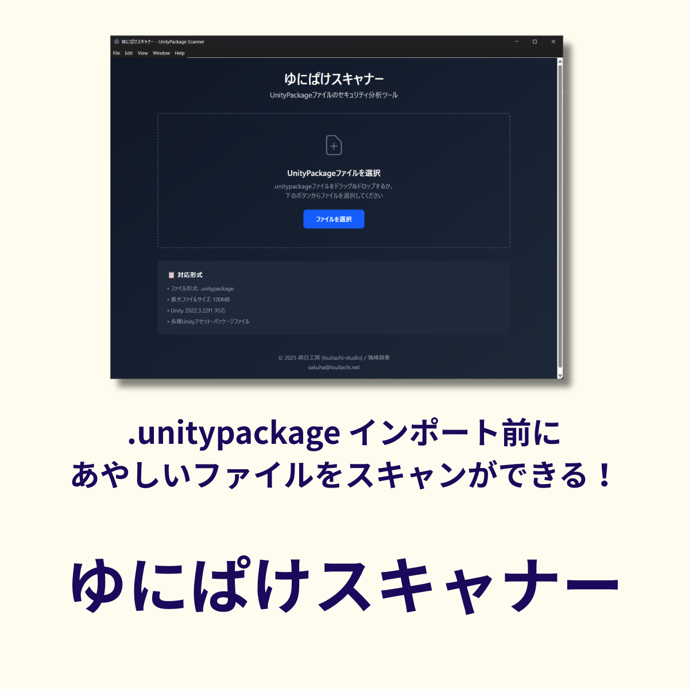

# ゆにぱけスキャナー (UnityPackage Scanner)

[](https://opensource.org/licenses/MIT)
[](https://github.com/sakuhanight/unitypackage-scanner/actions)

**UnityPackageファイルの安全性をパターンマッチング技術で分析するデスクトップアプリケーション**



## 📦 概要

ゆにぱけスキャナーは、第三者製のUnityPackage（.unitypackage）ファイルを使用する前に、その内容を分析して潜在的なセキュリティリスクを検出するツールです。

### 🎯 こんな方におすすめ

- 第三者製UnityPackageを使用前にチェックしたいUnity開発者
- パッケージの安全性を確認したい開発者
- セキュリティに敏感なUnityプロジェクト管理者

### ⚡ 主な特徴

- **完全オフライン動作** - インターネット接続不要、ローカルで完結
- **AIを使用しない** - パターンマッチングによる確実な検出
- **無償・オープンソース** - 完全無料で利用可能
- **クロスプラットフォーム** - Windows、macOS、Linux対応
- **直感的なUI** - ドラッグ&ドロップで簡単操作

## 🔍 検出できる危険なパターン

### 🔴 Critical（重大）
- **プロセス実行**: `Process.Start`, `ProcessStartInfo`
- **レジストリ操作**: `Registry.SetValue`, `RegistryKey.SetValue`

### 🟡 Warning（警告）
- **ネットワーク通信**: `UnityWebRequest`, `HttpClient`, `Socket`
- **ファイルシステム操作**: `File.Delete`, `Directory.Delete`, `FileStream`

### 🔵 Info（情報）
- **リフレクション**: `Assembly.Load`, `Type.GetType`, `MethodInfo.Invoke`
- **ネイティブコード**: `DllImport`, `Marshal.*`

## 📥 インストール

### リリース版（推奨）

1. [Releases](https://github.com/sakuhanight/unitypackage-scanner/releases)から最新版をダウンロード
2. お使いのOSに対応したインストーラーを実行:
   - **Windows**: `.exe` ファイル
   - **macOS**: `.dmg` ファイル
   - **Linux**: `.AppImage` ファイル（実行可能にして起動）

### 開発版（上級者向け）

```bash
# リポジトリをクローン
git clone https://github.com/sakuhanight/unitypackage-scanner.git
cd unitypackage-scanner

# 依存関係をインストール
pnpm install

# 開発サーバーを起動
pnpm dev

# または本番ビルド
pnpm build
```

**必須要件:** Node.js 18.x以上、pnpm 8.x以上

**技術スタック:**
- Electron + TypeScript + React
- Redux Toolkit (状態管理)
- Tailwind CSS v4 (スタイリング)
- Vitest (テスト)、Playwright (E2Eテスト)

## 🚀 使い方

### 基本的な使い方

1. **アプリケーションを起動**
   - 初回起動時は利用規約への同意が必要です

2. **ファイルを選択**
   - `.unitypackage` ファイルをドラッグ&ドロップ
   - または「選択」ボタンからファイルを選択

3. **スキャン実行**
   - 自動的にパッケージの分析が開始されます
   - プログレスバーで進行状況を確認

4. **結果確認**
   - **✅ 問題なし**: 危険なパターンは検出されませんでした
   - **⚠️ 注意が必要**: 警告レベル以上のパターンが検出されました

5. **詳細表示（必要に応じて）**
   - 「詳細を見る」で具体的な検出箇所を確認
   - 検出されたパターンと推奨される対処法を表示

### エクスポート機能

スキャン結果は以下の形式でエクスポート可能:
- **JSON**: 機械処理用
- **Markdown**: ドキュメント用
- **テキスト**: 簡易レポート用

## ⚙️ 設定

### 検出パターンの調整

**プリセット:**
- **標準（推奨）**: バランスの取れた検出レベル
- **厳格**: すべてのパターンを検出（誤検出の可能性あり）
- **緩和**: 明らかに危険なもののみ検出

**個別設定:**
各検出カテゴリを個別にON/OFF可能

### 除外設定

特定のファイルパスやパターンを検出から除外可能:
```
Plugins/ThirdParty/*
Assets/ExternalLibraries/*
```

## ⚠️ 重要な注意事項

### 免責事項

この分析結果はパターンマッチングによるものです。製作者（朔日工房/鴇峰朔華）は分析結果の正確性・完全性について**一切の責任を負いません**。

### 制限事項

- **完璧ではない**: すべての脅威を検出できるわけではありません
- **誤検出の可能性**: 安全なコードが危険として検出される場合があります
- **難読化に弱い**: 意図的に難読化されたコードは検出が困難です
- **最終判断はユーザー**: 分析結果を参考に、最終的な安全性はご自身で判断してください

## 🤝 コントリビューション

プロジェクトへの貢献を歓迎します！

- **バグ報告**: [Issues](https://github.com/sakuhanight/unitypackage-scanner/issues)でバグを報告
- **機能要望**: [Issues](https://github.com/sakuhanight/unitypackage-scanner/issues)で機能を提案
- **パターン追加**: 新しい検出パターンの追加提案
- **コード貢献**: Pull Requestでコードを改善

詳細は [CONTRIBUTING.md](CONTRIBUTING.md) をご覧ください。

## 📄 ライセンス

このプロジェクトは [MIT License](LICENSE) の下で公開されています。

## 🏢 製作者情報

- **サークル名**: 朔日工房 (tsuitachi-studio)
- **製作者**: 鴇峰朔華
- **連絡先**: [sakuha@tsuitachi.net](mailto:sakuha@tsuitachi.net)
- **ウェブサイト**: [https://tsuitachi.net](https://tsuitachi.net)
- **GitHub**: [sakuhanight/unitypackage-scanner](https://github.com/sakuhanight/unitypackage-scanner)

## 🔗 関連リンク

- [利用規約](docs/TERMS.md)
- [プライバシーポリシー](docs/PRIVACY.md)
- [パターン追加ガイド](docs/PATTERN_GUIDE.md)
- [FAQ](docs/FAQ.md)

---

<p align="center">
  Made with ❤️ by 朔日工房 (tsuitachi-studio)
</p>